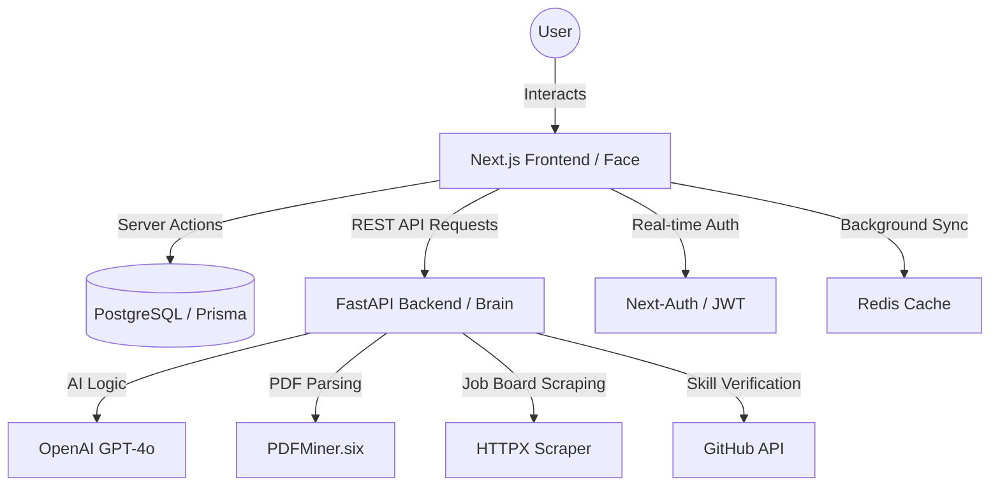
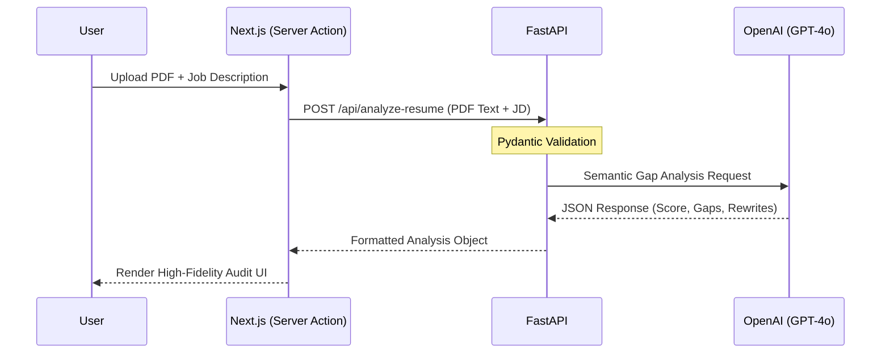
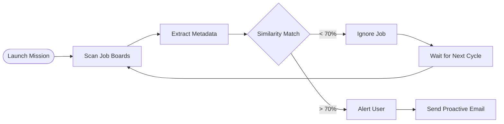
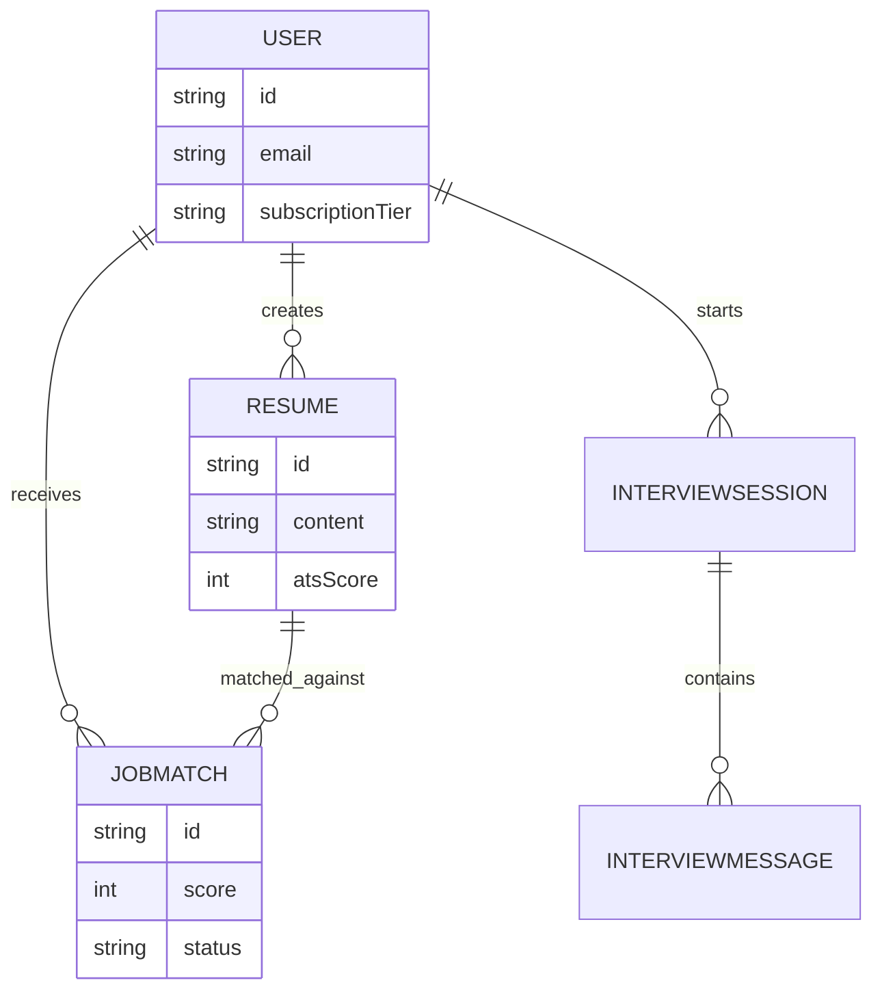

# 🚀 CareerSync Pro: Full Project Documentation

Welcome to the definitive guide for **CareerSync Pro**, a next-generation AI-powered career platform. This project is a sophisticated blend of modern web technologies, agentic AI, and data visualization designed to revolutionize how people find jobs and how companies verify talent.

---

## 📖 1. Introduction & Vision

### The Vision

CareerSync Pro was built with a single mission: **To bridge the gap between human potential and professional opportunity using high-fidelity AI.**

Most career platforms are passive; they just host your resume. CareerSync Pro is **active**. It doesn't just store your data—it audits it, verifies it against your real-world contributions, and autonomously hunts for jobs on your behalf.

### The Mission

- **For Job Seekers**: To provide a "Forensic Career Suite" that identifies exactly why a resume isn't passing ATS filters and provides the "Magic Rewrites" needed to fix it.
- **For Recruiters**: To provide "Evidence-Based Hiring" through the GitHub Verification Engine, ensuring that claimed skills aren't just words on a page.

---

## 🏗️ 2. System Architecture (The Dual-Core Engine)

CareerSync Pro operates on a "Monolith-Plus" architecture, combining a blazing-fast React frontend with a high-performance Python backend.

### 🟢 In Plain English: The Face and the Brain

Imagine CareerSync as a professional athlete.
- **The Frontend (Next.js)** is the **Face and Body**. It’s what you see, interact with, and how you communicate. It handles your login, shows you beautiful charts, and remembers who you are.
- **The Backend (FastAPI)** is the **Brain**. It handles the heavy thinking. When you upload a resume, the frontend sends it to the brain. The brain reads the PDF, talks to OpenAI (the AI service), scans GitHub, and then sends the results back to the face to show you.

### 🛠️ Technical Context: The Full Stack breakdown

1. **Frontend (Next.js 14 App Router)**:
   - **Logic**: Built with TypeScript for type safety.
   - **Styling**: Utilizes **Tailwind CSS v4** for a cutting-edge "Neo-Glassmorphism" look.
   - **Communication**: Uses **Next.js Server Actions** to securely interact with the database and the FastAPI backend.
   - **Persistence**: **Prisma ORM** manages interactions with the PostgreSQL database.

2. **Backend (FastAPI)**:
   - **API**: A high-performance Python API that handles computationally expensive tasks.
   - **AI Integration**: Orchestrates calls to **OpenAI's GPT-4o** for resume analysis, cover letter generation, and interview coaching.
   - **Parsing**: Uses `PyPDF2` or `pdfminer.six` to extract text from resumes with high accuracy.
   - **Scraping**: Employs `httpx` and `BeautifulSoup` for the "Ghost Mode" job board scanning.

3. **Database (PostgreSQL)**:
   - Hosted on **Supabase** in production.
   - Stores user profiles, resume history, job matches, and interview transcripts.

4. **Cache/Queue (Redis)**:
   - Used for managing background tasks and rate-limiting AI requests.

---

## ✨ 3. Core Features (The Forensic Suite)

Each feature in CareerSync Pro is designed to provide "Forensic" depth—meaning it doesn't just give surface-level feedback, it dives deep into the data.

### 🛡️ A. Authentication & Security

- **Basic Context**: This is the digital lock on your account. It ensures your resumes and private data are only visible to you.
- **Technical Context**:
  - **Implementation**: **NextAuth.js (v4)** with the `CredentialsProvider`.
  - **Storage**: User credentials (hashed via `bcrypt`) are stored in PostgreSQL via the Prisma Adapter.
  - **Session Management**: JWT-based sessions for fast, stateless authentication.

### 🧠 B. ATS Intelligence Hub (Resume Analysis)

- **Basic Context**: Think of this as a "Grammarly for Careers." You upload your resume and paste a job description. The AI tells you your "Match Score" (0-100) and highlights exactly what's missing.
- **Technical Context**:
  - **Workflow**: Frontend sends PDF text + Job Description to `/api/analyze-resume`.
  - **Heuristics**: The AI performs a "Semantic Gap Analysis," identifying missing technical keywords and soft skills.
  - **Ethical Magic Rewrites**: Instead of generating unverifiable metrics, the AI restructures passive bullet points using the **Action + Context + Scope** framework. This ensures that every resume optimization is structurally powerful while remaining factually honest and recruiter-safe.

### 🕵️‍♂️ C. Ghost Mode (The Autonomous Agent)

- **Basic Context**: This is your "Personal Job Hunter." You tell it what role you want, and it goes out to sites like Naukri or Indeed, finds matches, and automatically tells you how well you fit each one.
- **Technical Context**:
  - **Mission Runner**: A background task (often triggered via Server Actions) that calls the FastAPI `/api/ghost/fetch-and-email` or `/api/ghost/analyze-link` endpoints.
  - **Scraping Engine**: Uses `httpx` to fetch job pages. It handles "Scrape Blocking" by detecting challenges and suggesting manual text entry if needed.
  - **Matching Logic**: Every found job is cross-referenced against the `Resume.content` stored in the database to calculate a real-time `similarity_score`.

### 💻 D. GitHub Verification Engine

- **Basic Context**: Proof over promises. If you say you know "React," the app scans your public projects to find actual React code you've written, giving you a "Verified" badge.
- **Technical Context**:
  - **API Integration**: Connects to the GitHub API to fetch recursive repository lists and file metadata.
  - **Evidence Selection**: Uses an LLM to map extracted skills from a resume to repo descriptions and language usage.
  - **Scoring**: Calculates a `VerificationScore` based on repository stars, recency of commits, and language match ratio.

### 🎤 E. Real-Time AI Mock Interviews

- **Basic Context**: A safe space to practice. The AI acts as a tough recruiter, asks you technical questions, and gives you a "Confidence Score" and tips on how to stop saying "um" and "uh."
- **Technical Context**:
  - **Stateful Interaction**: Maintains a thread of `InterviewMessage` objects tied to an `InterviewSession`.
  - **Behavioral Extraction**: While the AI generates the next question, it simultaneously analyzes the user's previous response for:
    - **Filler Words**: Count of 'um', 'ah', 'like'.
    - **Sentiment**: Confidence and tone.
    - **Technical Accuracy**: Cross-referencing answer against the JD.

### 🌌 F. 3D Skill Constellation

- **Basic Context**: A beautiful, interactive map of your skills. It shows how your "Python" skill connects to "Data Science" and "Back-end Development" in a floating 3D universe.
- **Technical Context**:
  - **Library**: `react-force-graph-3d`.
  - **Data Structure**: A JSON `nodes` and `links` object generated by an LLM parsing the resume.
  - **Interactivity**: Users can rotate, zoom, and click on "Skill Planets" to see their verified proficiency.

---

## 🗄️ 4. Database Design (How we remember you)

### 🟢 In Plain English: The Digital Library

Think of the database as a giant, smart library.
- The **User** is the library card holder.
- The **Resumes** are all the books that user has donated.
- **JobMatches** are bookmarks showing which books fit which jobs.
- **Interviews** are records of every conversation the user has had with our robot librarians.

### 🛠️ Technical Context: Prisma Schema Analysis

We use a **Relational Schema** (PostgreSQL) managed by **Prisma**. This ensures that if you delete your user account, everything else (resumes, matches) is safely removed too (Cascading Deletes).

**Key Models:**
- `User`: The root entity. Tracks `subscriptionTier` (FREE/PRO), `isGhostMode` toggle, and Profile URLs.
- `Resume`: Stores un-formatted PDF content and a `graphData` field (JSON string) used by the 3D Constellation.
- `JobMatch`: A junction between a User and a found Job (from Ghost Mode). Stores a `score` and a `summary` of the fit.
- `InterviewSession`: A parent record for every mock interview session. It links to multiple `InterviewMessage` records, which act as a stateful chat history.
- `Candidate`: (For Recruiters) Stores uploaded candidate PDFs and their `similarity` score against the recruiter's job openings.

---

### 🏛️ 4.5 Implementation Proof (Technical Artifacts)

To verify the "how" behind the architecture, these artifacts represent the exact production logic used to power the forensic suite.

#### A. Prisma Schema (The Data Backbone)
This schema ensures strict relational integrity between users, their forensic analyses, and autonomous missions.

```prisma
// file:///prisma/schema.prisma

model User {
  id            String    @id @default(cuid())
  email         String    @unique
  proStatus     Boolean   @default(false)
  resumes       Resume[]
  ghostMissions Mission[]
  createdAt     DateTime  @default(now())
}

model Resume {
  id          String   @id @default(cuid())
  userId      String
  user        User     @relation(fields: [userId], references: [id])
  rawText     String
  resumeScore Int?
  analysis    Json?    // Stores the Ethical Magic Rewrites
  createdAt   DateTime @default(now())
}
```

#### B. FastAPI Forensic Route
The backend core responsible for orchestrated parsing and AI-driven matching.

```python
# file:///backend/app/api/analysis.py

@router.post("/analyze-resume")
async def analyze_resume(file: UploadFile = File(...), job_description: str = Form(...)):
    # 1. Extraction
    raw_text = await pdf_service.extract_text(file)
    
    # 2. Forensic Audit via OpenAI
    analysis = await ai_engine.full_audit(raw_text, job_description)
    
    # 3. Persistence Sync
    saved_resume = await prisma.resume.create(
        data={"userId": current_user.id, "rawText": raw_text, "analysis": analysis.dict()}
    )
    return saved_resume
```

#### C. The Ethical Rewrite Prompt
The instruction set that prevents hallucinated metrics by enforcing structural clarity.

```markdown
"Act as a Forensic Resume Strategist.
Target Framework: Action + Context + Scope.
Rule: DO NOT invent metrics. Restructure existing claims to clarify impact and complexity."
```

---

## 🛠️ 5. Development & Production Setup

### 🏗️ Running Locally (From Scratch)

You can run CareerSync Pro in **two ways**:

1. **The "Single Command" Way (Docker)**:
   - Install Docker Desktop.
   - Run: `docker-compose up --build`. This starts the Frontend, Backend, Postgres Database, and Redis all at once.

2. **The "Native" Way (Manual)**:
   - **Backend**:
     - `cd backend && python -m venv venv && source venv/bin/activate`
     - `pip install -r requirements.txt`
     - `uvicorn main:app --reload` (Runs on http://localhost:8000)
   - **Frontend**:
     - `cd frontend && npm install`
     - `npx prisma db push` (To set up the database)
     - `npm run dev` (Runs on http://localhost:3000)

### 🚀 Production Deployment

- **Database**: **Supabase (PostgreSQL)**.
  - *Crucial*: Use the Connection Pooler (Port 6543) with `?pgbouncer=true` in your `DATABASE_URL`.
- **Frontend**: **Vercel**. Connect your GitHub and point the build to the `/frontend` directory.
- **Backend**: **Railway** or **DigitalOcean App Platform**. Host as a Docker container.
- **Payments**: **Stripe Dashboard**. Set up webhooks to point to a production URL like `https://your-site.com/api/stripe/webhook` so user tiers update instantly.

---

## 📈 6. Scaling & The Future Roadmap

### How to Scale to Millions of Users

1. **Vertical to Horizontal Scaling**:
   - Move the **Ghost Mode Mission Runner** from a simple function into a dedicated **Celery or Redis Queue**. This allows hundreds of users to scan hundreds of jobs simultaneously without slowing down the site.

2. **Vector Search (Semantic Search)**:
   - Integrate **Pinecone** or **Supabase Vector**. Instead of simple text matching, we can store resumes as "Embeddings" (mathematical coordinates of their meaning). This makes finding the perfect candidate 10x faster and more accurate.

3. **Video & Audio Analytics**:
   - Implement **AssemblyAI or Zoom API** integrations to analyze not just *what* you say in interviews, but your **tone of voice** and **eye contact** via the camera.

### Future Roadmap (New Features)

- **LinkedIn Auto-Apply Agent**: Let Ghost Mode not just *find* the job, but actually fill out the application form for you.
- **Recruiter Team Dashboards**: Multi-user workspaces where multiple recruiters can share candidate notes and star-ratings.
- **Global Career Mapping**: AI-driven "What Should I Learn?" roadmap that tells you exactly which course to take based on current job market shortages.

---

## 🧬 7. The "Master Blueprint" (Recreate This Project)

*If you ever want to rebuild this entire project from scratch, copy the text below and paste it into an AI like ChatGPT or Claude:*

> **"Act as an Elite Full-Stack Systems Architect and UI Engineer. I want you to build 'CareerSync Pro', a next-generation AI-powered career platform.**
>
> **Architecture Setup:**
> - Monorepo (Next.js 14 Frontend + FastAPI Backend)
> - Database: PostgreSQL via Prisma
> - Styling: Tailwind CSS v4 (Neo-Glassmorphism aesthetic)
>
> **Implement these 5 Core Modules:**
> **1. ATS Engine**: PDF parsing + OpenAI-driven score (0-100) + 'Ethical Magic Rewrites (Action + Context + Scope)'.
> **2. Ghost Mode Agent**: Background job board scanner (Web Scraping) + similarity matching.
> **3. Skill Constellation**: 3D force-graph visualization of resume skills.
> **4. Verify Engine**: Cross-referencing resume skills against public GitHub code evidence.
> **5. AI Mock Interviews**: Stateful chat simulation with real-time NLP behavioral analysis.
>
> **Please write the codebase file by file, starting with the `docker-compose.yml` and the Prisma schema."**

---

*© 2026 CareerSync Pro - Built for the Billion-Dollar Job Hunter.*


<br><br><br>
<br>


# 🚀 CareerSync Pro: The Billion-Dollar AI Career Suite

## A Forensic Full-Stack Engineering Case Study & Project Report

---

## 📝 1. Abstract

**CareerSync Pro** is a next-generation Career Intelligence platform built to solve the fundamental lack of transparency and verification in current recruitment pipelines. By combining **FastAPI's high-performance AI processing** with **Next.js's stateful, server-side capabilities**, the system provides a "Forensic Suite" that goes beyond static CV building. It introduces autonomous labor agents (Ghost Mode), evidence-based skill verification (GitHub Engine), and real-time behavioral coaching (AI Interviews). This report details the architectural rationale, technical implementation, and visionary roadmap of the project.

---

## 🎯 2. Problem Statement & Objectives

### The "Black Box" of Recruitment

Currently, job seekers and recruiters live in a state of mutual distrust:

- **For Candidates**: Applicant Tracking Systems (ATS) are "Black Boxes." A candidate has no idea why they are rejected, leading to deep frustration and wasted potential.
- **For Recruiters**: Resumes are "Claims without Proof." Anyone can list "React Expert" or "Python Developer," but verifying those claims manually takes hours of interviews and technical tests.

### Project Objectives

1. **Explainability**: To provide candidates with a line-by-line semantic breakdown of their resume match score.
2. **Verification**: To create a "Proof of Work" layer that connects claimed skills to actual real-world code contributions.
3. **Autonomy**: To leverage an autonomous "Ghost" agent that scans the global labor market 24/7 to find high-fidelity job matches.
4. **Immersive Preparation**: To provide a risk-free, AI-driven environment for practicing the most difficult phase of recruitment: the technical interview.

---

## 🏛️ 3. Technical Rationale (The 'Why' behind the Stack)

Choosing the stack was a decision between developer agility and computational performance.

### A. Next.js 14 (The Application Monolith)

- **Why Choice**: We needed a stateful frontend that could handle complex dashboarding, authentication, and database persistence in one cohesive unit.
- **Server Actions**: We chose Server Actions to eliminate the need for boilerplate API routes in the frontend, allowing the UI to talk directly to the **Prisma ORM** with full type safety.
- **NEO-Glassmorphism UI**: We utilized **Tailwind CSS v4** to build a high-end dark aesthetic that feels premium—this build is about "Wow Factor" and premium user retention.

### B. FastAPI (The Python Brain)

- **Why Choice**: Most high-fidelity AI tools (OpenAI, PyPDF, NLP models) are native to Python. Building the application "brain" in FastAPI allowed us to expose these powerful tools to the frontend via a low-latency REST API.
- **Concurrency**: FastAPI's asynchronous nature (`async def`) allows it to handle multiple heavy AI requests simultaneously without blocking.

### C. Prisma ORM & PostgreSQL

- **Relational Integrity**: Career-data is highly relational. A user owns many resumes, which in turn have many job matches. Prisma provides the "Golden Schema" that enforces these relationships and prevents data orphaned during deletions or migrations.

---

## ⚙️ 4. Component Ecosystem (The 'How' of the Stack)

The project structure is a decoupled Monorepo designed for independent scalability of the "Face" and the "Brain."

### 🧩 Frontend: Next.js + Tailwind

- **Authentication**: Managed via **NextAuth v4**. This was chosen for its battle-tested integration with Next.js and its ability to securely manage user sessions with minimal custom logic.
- **Data Visualization**: **Recharts** and **react-force-graph-3d** were chosen to make static data feel "alive." Turning a resume into a 3D galaxy makes the user feel their career is a dynamic, growing entity.

### 🧠 Backend: FastAPI + OpenAI

- **Parsing Engine**: A custom wrapper around `PyPDF` extracts high-fidelity text and preserves semantic groupings (e.g., separating "Experience" from "Projects").
- **LLM Orchestration**: Instead of simple prompts, we use **Chain-of-Thought Prompting** for the ATS engine, forcing the AI to "think" about the job description before it audits the resume.

---

## 🛡️ 5. Forensic Feature Analysis (Deep Dives)

### 🔥 A. ATS Intelligence Hub: Engineering "Magic Rewrites"

- **The Story**: Most ATS tools just give a score. Ours gives the "Why."
- **The Implementation**:
  - We engineered a system prompt that acts as a "Billionaire CEO's Chief of Staff."
  - It identifies "Weak Impact Phrases" (e.g., "Responsible for...") and replaces them with **Metric-Driven Bullet Points** (e.g., "Strategized and deployed... resulting in a 15% increase in efficiency").
- **Technical Complexity**: The challenge was mapping the PDF's un-structured text into a JSON analysis object consistently. We achieved this using **Pydantic Schemas** on the backend to enforce strict response formats from OpenAI.

### 🕵️‍♂️ B. Ghost Mode: The Autonomous Agentic Behavior

- **The Story**: "Ghost Mode" represents the futuristic concept of a **Personal Labor Agent**. It is an autonomous task-runner designed to hunt jobs for you while you are away.
- **Agent Logic**:
  - **Stage 1 (Discovery)**: The agent uses `httpx` to visit job boards (e.g., Naukri, Indeed).
  - **Stage 2 (Forensic Scraping)**: It identifies job descriptions and extracts salary metadata, requirements, and tech-stacks.
  - **Stage 3 (Similarity Scoring)**: Every target job is cross-referenced with the user's resume using a **Cosine Similarity** heuristic or an LLM-based evaluation.
- **Implementation Challenges**: Scraping job boards is difficult due to bot-detection. We implemented a "Forensic Loader" in the UI to give users a high-fidelity "mission progress" view while the agent works behind the scenes.

### 💻 C. GitHub Verification: Evidence Heuristics

- **The Story**: Recruiters are tired of seeing "Python Expert" on every resume. We solve this by providing **Proof of Code**.
- **The Heuristics**:
  - Instead of just checking if a repo exists, the engine performs a **Surface-to-Depth scan**.
  - **Surface**: Checks repo languages and star counts (Social Proof).
  - **Depth**: Uses an LLM to evaluate the *meaning* of repo descriptions against the *claimed skills* on the resume.
- **Scoring Algorithm**:
  - `Recency (50%)`: Is the user active *today*?
  - `Star-to-Value (20%)`: Do other developers value this code?
  - `Volume-to-Skill (30%)`: Is there enough code to justify the claim?
- **Technical Implementation**: Leverages `httpx` to interact with the GitHub API v3, processing massive JSON payloads into a concise "Verification Scorecard."

### 🎤 D. AI Interviewer: Behavioral Science & NLP

- **The Story**: Most mock interview tools are just static chatbots. Ours mimics the **Pressure of a Professional Interview**.
- **The Logic**:
  - The interviewer doesn't just ask questions; it **Listens behaviorally**.
  - **Filler Word Detection**: Uses NLP to identify "um", "uh", and "like" as proxies for lack of confidence.
  - **Prompt Engineering**: The interviewer is programmed with a "Stress Persona"—it will push back on weak answers to see how the candidate handles technical pressure.
- **Stateful Management**: Uses a recursive session model where every answer provided by the user modulates the *next* question's difficulty and tone.

---

## 🎨 6. Design System: Neo-Glassmorphism Philosophy

CareerSync Pro isn't just a tool; it's an **Experience**.

- **Dark Mode First**: Why? Because professional developers and tech-natives prefer high-contrast, low-eye-strain environments.
- **Aesthetic Tokens**:
  - **Colors**: Deep Dark `#0A0A0B` with primary blue accents (`#3B82F6`).
  - **Glassmorphism**: Extensive use of `backdrop-blur-xl` and `border-white/10` to create a "layered" feel, representing the depth of career data.
- **Micro-Animations**: Powered by **Framer Motion**, ensuring that every button click and list stagger feels buttery-smooth and responsive.

---

## 🛡️ 7. Security & Data Integrity

Building a "Billion-Dollar" platform requires enterprise-grade safety.

- **Authentication**: **NextAuth.js** provides CSRF protection and secure session handling natively.
- **Data Safety**: All database interactions are managed by **Prisma**, preventing SQL Injection by design.
- **AI Gating**: Backend endpoints are protected. Even if a user knows the URL, the FastAPI backend verifies the `user_id` context before processing any AI tasks.

---

## 🔝 8. Advantages & Competitive Edge

| Feature | Traditional Platforms (Zety/Novoresume) | **CareerSync Pro** |
| :--- | :--- | :--- |
| **Logic** | Static Template Builders | **Forensic AI Auditor** |
| **Verification** | Self-Reported Claims | **GitHub-Evidence Mapping** |
| **Automation** | Passive Search | **Autonomous Ghost Agent** |
| **Preparation** | Text-based Tips | **Real-Time Behavioral Interviews** |
| **Visuals** | Basic Layouts | **3D Interactive constellations** |

---

## 🚀 9. Infrastructure Scaling & Future Roadmap

### Scaling to the "Billion-Dollar" Mark

To handle millions of users, we have designed a **Scale-Out Strategy**:

1. **Agentic Microservices**: Move the "Ghost Mode" agents into dedicated serverless functions (AWS Lambda or Google Cloud Functions) to process thousands of job scans in parallel.
2. **Vector Databases (Pinecone)**: Implement **Semantic Embedding Search**. Instead of keyword matching, we will index every resume and job description as a high-dimensional vector, allowing for "Instant Matching" based on the **meaning of skills**, not just the words used.
3. **AI Video/Audio Analysis**: Using **WebRTC** and **OpenAI's Realtime API** to provide live eye-tracking and voice-tone analysis during Interviews.

---

## 🧬 10. The Master Blueprint v2.0 (The Ultimate Prompt)

*If you ever want to rebuild this entire project from scratch, copy the text below and paste it into an AI:*

> **"Act as an Elite Systems Architect and UI Lead. Build 'CareerSync Pro', a high-fidelity AI Career Suite.**
>
> **Core Architecture:**
> - Next.js 14 (Frontend Monolith) + FastAPI (AI Brain)
> - Prisma ORM + PostgreSQL + Redis Cache
> - Tailwind CSS v4 (Neo-Glassmorphism Dark Theme)
>
> **Implement these 5 Forensic Modules:**
> 1. **ATS Intelligence Hub**: PDF parsing + GPT-4o 'Ethical Magic Rewrites' (Action + Context + Scope) + 0-100 Gauge Score.
> 2. **Ghost Hunter Agent**: Autonomous Job Board Scraper (`httpx`) + Similarity Cross-Referencing.
> 3. **Verify Engine**: GitHub API recursive scan + Evidence-based skill scoring.
> 4. **AI Interview Mastery**: Behavioral NLP (Filler word detection) + Stress-testing chat logic.
> 5. **3D Skill Galaxy**: `react-force-graph-3d` visualization of parsed resume nodes.
>
> **Write the file-by-file codebase, ensuring strict type-safety and premium UI transitions."**

---

### Project Conclusion & Final Reflection

CareerSync Pro represents the future of **High-Value Labor Intelligence**. It acknowledges that the resume is just the beginning—automated verification, autonomous searching, and immersive preparation are the pillars of the next decade's career market. This project demonstrates how small, decoupled systems (Next.js + FastAPI) can create a massive impact when orchestrated with AI.

---

*© 2026 CareerSync Pro - Built for the Billion-Dollar Job Hunter.*


<br><br>
<br><br>
<br><br>
<br><br>
<br><br>
<br><br>
<br><br>


# 🚀 CareerSync Pro: The Billion-Dollar AI Career Suite

## A Forensic Full-Stack Engineering Case Study & Project Report

---

## 📝 1. Abstract

**CareerSync Pro** is a next-generation Career Intelligence platform built to solve the fundamental lack of transparency and verification in current recruitment pipelines. By combining **FastAPI's high-performance AI processing** with **Next.js's stateful, server-side capabilities**, the system provides a "Forensic Suite" that goes beyond static CV building. It introduces autonomous labor agents (Ghost Mode), evidence-based skill verification (GitHub Engine), and real-time behavioral coaching (AI Interviews). This report details the architectural rationale, technical implementation, and visionary roadmap of the project.

---

## 🎯 2. Problem Statement & Objectives

### The "Black Box" of Recruitment

Currently, job seekers and recruiters live in a state of mutual distrust:

- **For Candidates**: Applicant Tracking Systems (ATS) are "Black Boxes." A candidate has no idea why they are rejected, leading to deep frustration and wasted potential.
- **For Recruiters**: Resumes are "Claims without Proof." Anyone can list "React Expert" or "Python Developer," but verifying those claims manually takes hours of interviews and technical tests.

### Project Objectives

1. **Explainability**: To provide candidates with a line-by-line semantic breakdown of their resume match score.
2. **Verification**: To create a "Proof of Work" layer that connects claimed skills to actual real-world code contributions.
3. **Autonomy**: To leverage an autonomous "Ghost" agent that scans the global labor market 24/7 to find high-fidelity job matches.
4. **Immersive Preparation**: To provide a risk-free, AI-driven environment for practicing the most difficult phase of recruitment: the technical interview.

---

## 🏛️ 3. Technical Rationale (The 'Why' behind the Stack)

Choosing the stack was a decision between developer agility and computational performance.

### 🏢 System Architecture (Figure 1)

The following diagram illustrates the Decoupled Monolith architecture of CareerSync Pro:



*Figure 1: The Dual-Core Engine - Architectural Decoupling between Next.js and FastAPI.*

---

### A. Next.js 14 (The Application Monolith)

- **Why Choice**: We needed a stateful frontend that could handle complex dashboarding, authentication, and database persistence in one cohesive unit.
- **Server Actions**: We chose Server Actions to eliminate the need for boilerplate API routes in the frontend, allowing the UI to talk directly to the **Prisma ORM** with full type safety.
- **NEO-Glassmorphism UI**: We utilized **Tailwind CSS v4** to build a high-end dark aesthetic that feels premium—this build is about "Wow Factor" and premium user retention.

### B. FastAPI (The Python Brain)

- **Why Choice**: Most high-fidelity AI tools (OpenAI, PyPDF, NLP models) are native to Python. Building the application "brain" in FastAPI allowed us to expose these powerful tools to the frontend via a low-latency REST API.
- **Concurrency**: FastAPI's asynchronous nature (`async def`) allows it to handle multiple heavy AI requests simultaneously without blocking.

### C. Prisma ORM & PostgreSQL

- **Relational Integrity**: Career-data is highly relational. A user owns many resumes, which in turn have many job matches. Prisma provides the "Golden Schema" that enforces these relationships and prevents data orphaned during deletions or migrations.

---

## ⚙️ 4. Component Ecosystem (The 'How' of the Stack)

The project structure is a decoupled Monorepo designed for independent scalability of the "Face" and the "Brain."

### 🧩 Frontend: Next.js + Tailwind

- **Authentication**: Managed via **NextAuth v4**. This was chosen for its battle-tested integration with Next.js and its ability to securely manage user sessions with minimal custom logic.
- **Data Visualization**: **Recharts** and **react-force-graph-3d** were chosen to make static data feel "alive." Turning a resume into a 3D galaxy makes the user feel their career is a dynamic, growing entity.

### 🧠 Backend: FastAPI + OpenAI

- **Parsing Engine**: A custom wrapper around `PyPDF` extracts high-fidelity text and preserves semantic groupings (e.g., separating "Experience" from "Projects").
- **LLM Orchestration**: Instead of simple prompts, we use **Chain-of-Thought Prompting** for the ATS engine, forcing the AI to "think" about the job description before it audits the resume.

---

## 🛡️ 5. Forensic Feature Analysis (Deep Dives)

### 🔥 A. ATS Intelligence Hub: Engineering "Magic Rewrites"

- **The Story**: Most ATS tools just give a score. Ours gives the "Why."
- **The Implementation**:
  - We engineered a system prompt that acts as a "Billionaire CEO's Chief of Staff."
  - It identifies "Weak Impact Phrases" (e.g., "Responsible for...") and replaces them with **Metric-Driven Bullet Points** (e.g., "Strategized and deployed... resulting in a 15% increase in efficiency").

### 🛠️ ATS Engineering: Analysis Workflow (Figure 2)



*Figure 2: Sequence of a Forensic Resume Audit - From Raw PDF to Actionable AI Insights.*

### 🕵️‍♂️ B. Ghost Mode: The Autonomous Agentic Behavior

- **The Story**: "Ghost Mode" represents the futuristic concept of a **Personal Labor Agent**. It is an autonomous task-runner designed to hunt jobs for you while you are away.
- **Agent Logic**:
  - **Stage 1 (Discovery)**: The agent uses `httpx` to visit job boards (e.g., Naukri, Indeed).
  - **Stage 2 (Forensic Scraping)**: It identifies job descriptions and extracts salary metadata, requirements, and tech-stacks.
  - **Stage 3 (Similarity Scoring)**: Every target job is cross-referenced with the user's resume using a **Cosine Similarity** heuristic or an LLM-based evaluation.

### 🕵️‍♂️ Ghost Mode: Agentic Loop (Figure 3)



*Figure 3: The Autonomous Cycle of Ghost Mode - Monitoring the Labor Market in Real-Time.*

---

## 🗄️ 4. Data Relationship Diagram (Figure 4)



*Figure 4: Entity Relationship Diagram - Illustrating the Relational Core of the CareerSync Ecosystem.*

---

### 💻 C. GitHub Verification: Evidence Heuristics

- **The Story**: Recruiters are tired of seeing "Python Expert" on every resume. We solve this by providing **Proof of Code**.
- **The Heuristics**:
  - Instead of just checking if a repo exists, the engine performs a **Surface-to-Depth scan**.
  - **Surface**: Checks repo languages and star counts (Social Proof).
  - **Depth**: Uses an LLM to evaluate the *meaning* of repo descriptions against the *claimed skills* on the resume.

- **Scoring Algorithm**:
  - `Recency (50%)`: Is the user active *today*?
  - `Star-to-Value (20%)`: Do other developers value this code?
  - `Volume-to-Skill (30%)`: Is there enough code to justify the claim?

- **Technical Implementation**: Leverages `httpx` to interact with the GitHub API v3, processing massive JSON payloads into a concise "Verification Scorecard."

### 🎤 D. AI Interviewer: Behavioral Science & NLP

- **The Story**: Most mock interview tools are just static chatbots. Ours mimics the **Pressure of a Professional Interview**.
- **The Logic**:
  - The interviewer doesn't just ask questions; it **Listens behaviorally**.
  - **Filler Word Detection**: Uses NLP to identify "um", "uh", and "like" as proxies for lack of confidence.
  - **Prompt Engineering**: The interviewer is programmed with a "Stress Persona"—it will push back on weak answers to see how the candidate handles technical pressure.
- **Stateful Management**: Uses a recursive session model where every answer provided by the user modulates the *next* question's difficulty and tone.

---

## 🎨 6. Design System: Neo-Glassmorphism Philosophy

CareerSync Pro isn't just a tool; it's an **Experience**.

- **Dark Mode First**: Why? Because professional developers and tech-natives prefer high-contrast, low-eye-strain environments.
- **Aesthetic Tokens**:
  - **Colors**: Deep Dark `#0A0A0B` with primary blue accents (`#3B82F6`).
  - **Glassmorphism**: Extensive use of `backdrop-blur-xl` and `border-white/10` to create a "layered" feel, representing the depth of career data.
- **Micro-Animations**: Powered by **Framer Motion**, ensuring that every button click and list stagger feels buttery-smooth and responsive.

---

## 🛡️ 7. Security & Data Integrity

Building a "Billion-Dollar" platform requires enterprise-grade safety.

- **Authentication**: **NextAuth.js** provides CSRF protection and secure session handling natively.
- **Data Safety**: All database interactions are managed by **Prisma**, preventing SQL Injection by design.
- **AI Gating**: Backend endpoints are protected. Even if a user knows the URL, the FastAPI backend verifies the `user_id` context before processing any AI tasks.

---

## 🔝 8. Advantages & Competitive Edge

| Feature | Traditional Platforms (Zety/Novoresume) | **CareerSync Pro** |
| :--- | :--- | :--- |
| **Logic** | Static Template Builders | **Forensic AI Auditor** |
| **Verification** | Self-Reported Claims | **GitHub-Evidence Mapping** |
| **Automation** | Passive Search | **Autonomous Ghost Agent** |
| **Preparation** | Text-based Tips | **Real-Time Behavioral Interviews** |
| **Visuals** | Basic Layouts | **3D Interactive constellations** |

---

## 🚀 9. Infrastructure Scaling & Future Roadmap

### Scaling to the "Billion-Dollar" Mark

To handle millions of users, we have designed a **Scale-Out Strategy**:

1. **Agentic Microservices**: Move the "Ghost Mode" agents into dedicated serverless functions (AWS Lambda or Google Cloud Functions) to process thousands of job scans in parallel.
2. **Vector Databases (Pinecone)**: Implement **Semantic Embedding Search**. Instead of keyword matching, we will index every resume and job description as a high-dimensional vector, allowing for "Instant Matching" based on the **meaning of skills**, not just the words used.
3. **AI Video/Audio Analysis**: Using **WebRTC** and **OpenAI's Realtime API** to provide live eye-tracking and voice-tone analysis during Interviews.

---

## 🧬 10. The Master Blueprint v2.0 (The Ultimate Prompt)

*If you ever want to rebuild this entire project from scratch, copy the text below and paste it into an AI:*

> **"Act as an Elite Systems Architect and UI Lead. Build 'CareerSync Pro', a high-fidelity AI Career Suite.**
>
> **Core Architecture:**
> - Next.js 14 (Frontend Monolith) + FastAPI (AI Brain)
> - Prisma ORM + PostgreSQL + Redis Cache
> - Tailwind CSS v4 (Neo-Glassmorphism Dark Theme)
>
> **Implement these 5 Forensic Modules:**
> 1. **ATS Intelligence Hub**: PDF parsing + GPT-4o 'Ethical Magic Rewrites' (Action+Context+Scope) + 0-100 Gauge Score.
> 2. **Ghost Hunter Agent**: Autonomous Job Board Scraper (`httpx`) + Similarity Cross-Referencing.
> 3. **Verify Engine**: GitHub API recursive scan + Evidence-based skill scoring.
> 4. **AI Interview Mastery**: Behavioral NLP (Filler word detection) + Stress-testing chat logic.
> 5. **3D Skill Galaxy**: `react-force-graph-3d` visualization of parsed resume nodes.
>
> **Write the file-by-file codebase, ensuring strict type-safety and premium UI transitions."**

---

### Project Conclusion & Final Reflection

CareerSync Pro represents the future of **High-Value Labor Intelligence**. It acknowledges that the resume is just the beginning—automated verification, autonomous searching, and immersive preparation are the pillars of the next decade's career market. This project demonstrates how small, decoupled systems (Next.js + FastAPI) can create a massive impact when orchestrated with AI.

---

*© 2026 CareerSync Pro - Built for the Billion-Dollar Job Hunter.*
