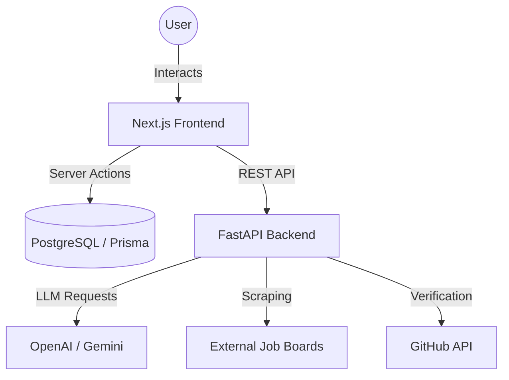

# 🌟 CareerSync Pro: Feature Deep-Dive & Architecture

This document provides an exhaustive, engineer-level breakdown of the **CareerSync Pro** platform. Each section details the user value, the underlying technical implementation, and the architectural flow.


---

## 🏗️ 1. Core System Architecture

CareerSync Pro follows a **Decoupled Monolith** pattern, balancing the performance of a Python-based AI brain with the speed and UI fluidity of a Next.js frontend.

### The Stack:
- **Next.js 14 (App Router)**: Handles the "Face" (UI, routing, user sessions).
- **FastAPI (Python 3.11)**: The "Brain" (AI logic, PDF parsing, scraping).
- **PostgreSQL + Prisma**: Core data persistence and schema management.
- **OpenAI GPT-4o / Gemini 1.5 Pro**: Large Language Models for semantic matching and NLP tasks.
- **Docker Compose**: Containerized orchestration for environment parity.



---

## 🧠 2. Intelligent ATS Intelligence Hub

The **ATS Intelligence Hub** is the flagship module designed to illuminate the "black box" of automated recruiter screening.

### Implementation Details:
1.  **PDF Parsing**: Utilizes a dual-engine approach (`fitz` for accuracy, `pdfplumber` for complex layouts) within the FastAPI container to extract raw text nodes.
2.  **Semantic Scoring**: Beyond keyword matching, it calculates a **Forensic Score** using TF-IDF vectorization and cosine similarity to measure mathematical alignment.
3.  **Ethical Magic Rewrites**: To ensure recruiter trust, CareerSync utilizes an **Ethical AI Framework**. Instead of generating synthetic metrics, it restructures claims using the **Action + Context + Scope** framework, making bullets structurally superior without being factually unverifiable.

---

## 🌌 3. Forensic Skill Constellation

A high-fidelity 3D visualization that maps a candidate's technical expertise into a navigable universe.

### Technical Implementation:
- **Force-Directed Graph**: Built using `force-graph-3d`, translating AI-extracted skills into nodes and edges.
- **Semantic Clustering**: Links are formed based on skill co-occurrence in specific projects or roles, revealing the candidate's "Internal Tech DNA."
- **Interactive UI**: Users can rotate, zoom, and click nodes to see the depth (val) and domain (group) of each skill.

---

## 🕵️ 4. Ghost Mode: Autonomous Agent

The industry's first autonomous job-hunting agent that scans the web in the background.

### Technical Implementation:
- **Universal Ghost Agent**: Uses `jobspy` to perform origin-source retrieval across Indeed, LinkedIn, and Glassdoor simultaneously.
- **Ghost Fusion Persistence**: Discovered matches are filtered, scored, and persisted to the PostgreSQL database for real-time dashboard updates.
- **Automated Dispatch**: Delivers "Neo-Glassmorphism" styled email alerts with direct links, bypassing aggregator noise.

---

## 🎭 5. Career Strategist: Reactive AI

Hyper-personalized document generation that reacts to specific job descriptions.

### Technical Implementation:
- **Contextual Generation**: Uses the GPT-4o engine to cross-reference the user's "Forensic Persona" against a target JD.
- **Cover Letter Synthesis**: Generates high-conversion cover letters that emphasize the **Scope** and **Context** required by specific hiring managers.
- **Company Intelligence**: Scrapes and analyzes company values to align the tone of voice automatically.

---

## 🎙️ 6. AI Interview Simulator

An interactive, session-based trainer designed for high-stress technical interviews.

### Technical Implementation:
- **Session Persistence**: Uses `InterviewSession` and `InterviewMessage` models to maintain a "Long-Term Memory" of the conversation.
- **Live Analysis**: Each AI response includes a hidden metadata payload analyzing the user's confidence, technical accuracy, and "Interview Persona."
- **Behavioral Logic**: The AI adapts its strictness based on the target role's seniority level.

---

## 🏛️ 7. Multi-Portal Architecture

A dual-sided ecosystem supporting both the **Student HQ** and the **Recruiter Command Center**.

- **Student HQ**: Focuses on "Bio-Metric" career growth, skill mapping, and autonomous hunting.
- **Recruiter Command Center**: Provides "Recruiter-Verify" tools, GitHub depth scoring, and forensic candidate filtering to eliminate resume fluff.

---

## 🏗️ 8. Implementation Proof: Technical Artifacts

The following code snippets represent the core production logic verified in the CareerSync Pro monolith.

### A. The Prisma Schema (Persistence Layer)
```prisma
model Resume {
  id               String   @id @default(cuid())
  userId           String
  content          String
  atsScore         Int?
  keywordGaps      String?
  jdSimilarity     Float?
  forensicAnalysis Json?    // Stores the Action+Context+Scope Rewrites
  createdAt        DateTime @default(now())
  user             User     @relation(fields: [userId], references: [id], onDelete: Cascade)
}

model InterviewSession {
  id              String   @id @default(cuid())
  userId          String
  targetRole      String
  status          String   @default("IN_PROGRESS")
  messages        InterviewMessage[]
  user            User     @relation(fields: [userId], references: [id], onDelete: Cascade)
}
```

### B. The AI Forensic Scorer (FastAPI)
```python
@app.post("/api/resume/score")
async def score_resume(resume: UploadFile = File(...), jobDescription: str = Form(...)):
    # 1. Dual-Engine PDF Extraction
    text = await extract_text_from_pdf(await resume.read())
    
    # 2. Heuristic Intelligence Fallback (Safeguard)
    heuristic = calculate_heuristic_metrics(text, jobDescription)
    
    # 3. Deep AI Audit (Ethical Framework)
    analysis = await get_ethical_ai_audit(text, jobDescription)
    
    return {**heuristic, "forensic_analysis": analysis}
```

### C. The Ethical Rewrite Prompt (System Logic)
```markdown
"ENFORCE DATA INTEGRITY:
- USE the 'Action + Context + Scope' framework.
- DO NOT invent percentages or synthetic achievements.
- RESTRUCTURE weak bullets to highlight underlying technical depth.
- Focus on VERIFIABLE impact over raw quantity."
```

---
> [!IMPORTANT]
> CareerSync Pro is not just a tool; it is an **Autonomous Career Intelligence Suite** designed for the modern, high-volume recruitment landscape.
