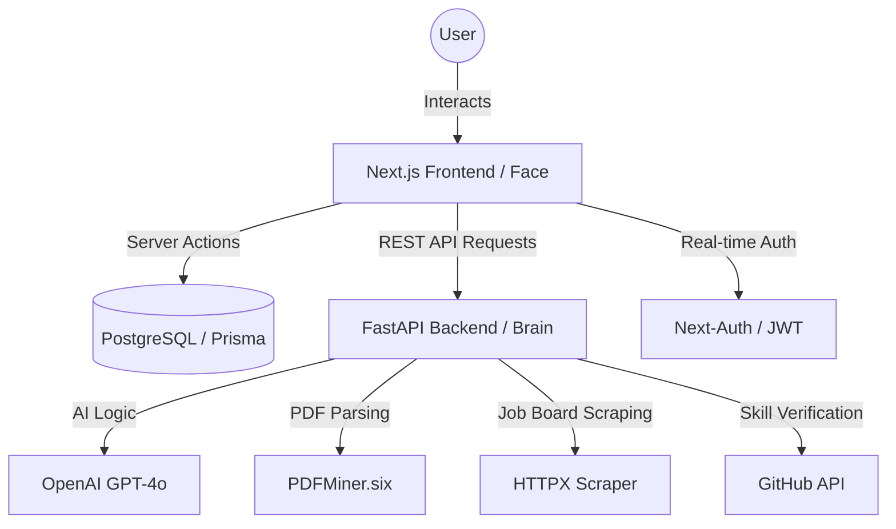

# INTERNSHIP REPORT 
**ON**
**CAREERSYNC PRO: THE AUTONOMOUS AI CAREER & ATS VERIFICATION SUITE**

**BY**          
**Name of the Student: AMAN AGARWAL**
**Roll No.: 12211017**

**PREPARED IN THE PARTIAL FULFILMENT OF THE**
**INTERNSHIP COURSE**

**AT**

**INDIAN INSTITUTE OF INFORMATION TECHNOLOGY, SONEPAT**
**TECHNO PARK, RAJIV GANDHI EDUCATION CITY,**
**RAI, SONEPAT, HARYANA-131029**

**INDIAN INSTITUTE OF INFORMATION TECHNOLOGY, SONEPAT**
**JUNE, 2026**

## CERTIFICATE

This is to certify that the Internship Project of **Aman Agarwal** titled **CareerSync Pro: The Autonomous AI Career Suite** is an original work and that this work has not been submitted anywhere in any form. Indebtedness to other works/publications has been duly acknowledged at relevant places. The project work was carried during **May 2026** to **June 2026** in **Indian Institute of Information Technology, Sonepat**.

   

**Signature Mentor faculty**
Name: Dr. Sourabh Jain
Designation: Faculty Incharge
(Seal of the organization with Date)

## JOINING REPORT

**Indian Institute of Information Technology, Sonepat**
**INHOUSE Internship JOINING REPORT**

**Date of Joining The Internship Station:** ___________________________
**Period of Internship From:** _________________ **To:** _________________
**Total Months:** 2 Months

**Student Information**
- **Name**: Aman Agarwal
- **Roll No**: 12211017
- **Branch**: Computer Science and Engineering / IT

**Student’s Signature with Date**: ___________________________

**Name and Address of the Internship Station**: Indian Institute of Information Technology, Sonepat, Techno Park, Rajiv Gandhi Education City, Rai, Sonepat, Haryana-131029
**Name and Designation of the Mentor faculty for the Project**: Dr. Sourabh Jain, Faculty Incharge

**Signature of Faculty Mentor**: ___________________________
**Faculty Mentor E-mail Address**: ___________________________

## ACKNOWLEDGEMENTS

I would like to take this opportunity to express my sincere gratitude to all those who have supported and guided me throughout my internship.

First and foremost, I am deeply thankful to the faculty members of the Indian Institute of Information Technology, Sonepat for providing me with a strong academic foundation and continuous encouragement that enabled me to undertake this in-house internship. Their guidance has played an important role in my academic and professional growth.

I am extremely grateful for the opportunity to work as a Software Development Engineer Intern conceptualizing and building **CareerSync Pro**. This internship has been a highly enriching experience and has significantly enhanced my understanding of AI-driven recruitment platforms, real-time data processing, and large language model architectures.

I would like to express my sincere gratitude to the leadership and faculty team at IIIT Sonepat for building a highly collaborative and learning-driven research environment and for their valuable guidance and support.

I would also like to sincerely thank my project mentor, Dr. Sourabh Jain, and peers for their continuous guidance, technical insights, and support. Their expertise in high-performance systems, React frontends, and Python backends has greatly contributed to my learning during this period.

I am also thankful to my colleagues and friends for fostering a collaborative and supportive environment, which continues to help me grow both technically and professionally.

Finally, I extend my gratitude to everyone who has directly or indirectly contributed to my learning experience during this internship. Their support, encouragement, and feedback have been invaluable.

I am truly grateful to all of you and look forward to continuing to learn and apply these experiences in my future endeavors.

**Aman Agarwal**  
(12211017)

## ABSTRACT SHEET

**Title**: CareerSync Pro: The Autonomous AI Career Suite
**Author**: Aman Agarwal
**Supervision**: Dr. Sourabh Jain, IIIT Sonepat

The modern recruitment process suffers from severe inefficiencies, primarily driven by the opacity of Applicant Tracking Systems (ATS) and the inability of recruiters to instantly verify claimed candidate skills. This report presents the work carried out during my in-house internship at the Indian Institute of Information Technology, Sonepat as a Software Development Engineer Intern. The primary objective of the internship was to design and develop an autonomous AI-driven platform (CareerSync Pro) to solve these inefficiencies in modern candidate screening.

The work involved engineering a decoupled monolithic pipeline, consisting of a Next.js frontend, FastAPI backend, and PostgreSQL database. A key contribution was the design and implementation of an Applicant Tracking System (ATS) Intelligence Hub utilizing Large Language Models to perform semantic gap analysis and provide line-by-line scoring feedback.

In addition, I developed an autonomous agent ("Ghost Mode") to scrape real-time job boards and calculate dynamic match scores. I also designed a GitHub Verification Engine to programmatically analyze public repositories, ensuring the robust verification of claimed developer skills. Furthermore, I worked on setting up an AI-driven Mock Interview simulator that extracts real-time behavioral NLP metrics.

The results demonstrate significantly improved system scalability, recruitment transparency, and automated skill verification. This internship has provided valuable exposure to full-stack system architecture, Generative AI application development, and autonomous agent design.

## CONTENTS

| Heading | Page No. |
| :--- | :--- |
| **Cover page** | 1 |
| **Certificate** | 2 |
| **Joining Report** | 3 |
| **Acknowledgements** | 4 |
| **Abstract Sheet** | 5 |
| **1. A brief introduction of the organization’s business sector** | 7 |
| **2. Overview of the organization** | 8 |
| **3. Plan of your internship program** | 9 |
| **4. Background and description of the problem (Introduction)** | 10 |
| **5. Main Text** | 11 |
| &nbsp;&nbsp;&nbsp;&nbsp;5.1 System Architecture & Assumptions | 11 |
| &nbsp;&nbsp;&nbsp;&nbsp;5.2 Methodology: ATS Intelligence Hub | 12 |
| &nbsp;&nbsp;&nbsp;&nbsp;5.3 Methodology: Ghost Mode Agent Flowchart | 13 |
| &nbsp;&nbsp;&nbsp;&nbsp;5.4 Experimental Work: GitHub Verification Engine | 14 |
| &nbsp;&nbsp;&nbsp;&nbsp;5.5 Database Architecture (ERD) | 15 |
| **6. Outcomes** | 16 |
| **7. Conclusions and Recommendations** | 17 |
| **8. Appendices** | 18 |
| **9. References** | 19 |

## 2. OVERVIEW OF CAREER TECHNOLOGY & AI RECRUITMENT SECTOR

The Career Technology (CareerTech) sector plays a vital role in economic development by facilitating human capital formation, labor market liquidity, and efficient skill discovery. CareerTech platforms enable individuals, corporations, and educational institutions to navigate the hiring landscape through digital instruments such as professional profiles, job postings, and technical assessments. In India, major platforms such as Naukri.com, LinkedIn, and Hirist provide centralized ecosystems for matching talent with industrial demand.

In addition to domestic platforms, global CareerTech markets play a significant role in providing talent mobility and cross-border diversification opportunities. Prominent international platforms include Indeed, Glassdoor, Monster.com, and ZipRecruiter. These platforms handle massive volumes of application data and operate highly advanced algorithmic screening systems. Participation in both national and international networks allows recruitment firms to diversify their talent sourcing strategies and respond to global workforce movements.

The CareerTech sector consists of various participants, including Job Boards, Applicant Tracking System (ATS) providers, Recruitment Process Outsourcing (RPO) firms, and Background Verification agencies. Job boards act as centralized platforms for vacancy publication, while ATS providers offer the infrastructure for candidate management. Specialized assessment firms ensure skill validation and manage candidate risk, while professional networks maintain digital records of career ownership and credentials.

Modern career markets are entirely technology-driven and operate through automated screening systems that filter thousands of applications in milliseconds. The rise of Generative AI and automated workforce intelligence has significantly increased the demand for high-fidelity, transparent matching infrastructure. In such environments, even minimal biases in data processing or keyword filtering can impact hiring outcomes and candidate success.

Resume and job data are critical components of these systems. Employers continuously broadcast real-time job feeds containing mission requirements, salary brackets, and required tech stacks. These data streams are processed using specialized AI career pipelines that ensure correct semantic parsing, entity extraction, and reconstruction of candidate profiles to find the most accurate match.

Various career instruments are utilized in the market. Resumes represent a candidate's historical ownership of skills, while dynamic portfolios and technical evidence (like GitHub contributions) derive their value from underlying real-world output. Job seekers use different application types, such as direct applications, referral-based entries, and automated agentic applications, to implement their career growth strategies.

The increasing complexity of the recruitment landscape has led to the development of advanced systems such as AI Auditing engines, Applicant Tracking Systems (ATS), and autonomous career agents. These systems rely on optimized transformer-based algorithms, efficient vector data structures, and high-speed processing to handle large volumes of NLP data with minimal semantic loss.

Overall, the CareerTech and AI recruitment sector is highly dynamic and continuously evolving, driven by technological advancements and increasing global labor integration. The ability to design and operate efficient, AI-centric career intelligence systems is essential for success in modern, competitive professional environments.

## 2. ORGANIZATION OVERVIEW (IIIT SONEPAT)

Indian Institute of Information Technology, Sonepat is a technology-driven research and educational institution specializing in the development of advanced software systems and algorithmic solutions across multiple technical domains. The institute actively fosters in-house projects—such as CareerSync Pro—enabling high-fidelity system design and broader participation in the global Artificial Intelligence and CareerTech sectors.

The organization focuses on building high-performance and AI-centric software systems that can efficiently process large-scale natural language data and execute autonomous career intelligence tasks with minimal semantic loss. Its core competency lies in designing sophisticated full-stack architectures that operate in data-sensitive environments while maintaining strict security and data integrity protocols.

The project's technology stack incorporates advanced modern frameworks, including Next.js 14 for stateful frontend monoliths, FastAPI for high-performance Python backends, and Prisma ORM for relational data persistence. These systems are designed to handle large volumes of resume and job data daily, requiring robust, scalable, and fault-tolerant architectures.

The in-house research initiative consists of multiple specialized functional modules, including the ATS Intelligence Hub, the Ghost Mode Autonomous Agent, and GitHub Verification Engines. The AI Career Pipeline is responsible for processing raw candidate data into structured JSON formats, constructing semantic skill galaxies, and delivering real-time career insights to users.

The institute emphasizes continuous innovation, performance optimization, and architectural reliability. Its infrastructure is designed using modern software engineering techniques such as responsive state management, asynchronous background processing via FastAPI, and optimized prompt engineering to achieve high accuracy and system fluidity.

The research environment promotes collaboration between technical mentors, student software engineers, and domain researchers, providing a comprehensive understanding of how software architecture supports real-world recruitment strategies. This interdisciplinary approach enables the development of efficient, scalable, and reliable systems tailored to the demands of modern, AI-first labor markets.

Overall, IIIT Sonepat stands as a strong example of how advanced technical education and software engineering research are integrated to build high-performance, real-world applications in the modern digital era.

## 4. INTERNSHIP PLAN

I am currently undergoing my internship at the **Indian Institute of Information Technology, Sonepat** as a Software Development Engineer Intern for the **CareerSync Pro** project from May 2026 to June 2026.

The internship began with an initial research and architectural onboarding phase, during which structured technical design sessions were conducted regularly. In these sessions, the architectural requirements for a "Decoupled Monolith" were explained, covering system workflows and individual module responsibilities. This included detailed discussions on core components such as the **ATS Intelligence Hub**, the **Ghost Mode Agent**, and other AI infrastructure modules. These sessions helped in understanding how the frontend server actions coordinate with the FastAPI backend and how the overall career suite operates as an integrated AI pipeline.

Following this, I started working within the Full-Stack Engineering team, focusing on the development and analysis of autonomous career intelligence infrastructure used in real-time candidate screening environments.

The major areas and research modules involved during the internship include:
- AI Systems Research and Large Language Model (LLM) Integration
- Low-latency API infrastructure and prompt optimization
- Testing and performance monitoring of autonomous scraping agents

The key responsibilities undertaken during the internship are as follows:
- Studying and analyzing the complete AI resume-parsing pipeline and its components.
- Designing and implementing high-fidelity test cases for the ATS Scoring Engine and Semantic Gap Analysis using Pydantic validation.
- Developing latency monitoring and automated performance reporting for LLM-based API calls.
- Measuring and optimizing token usage and response times between the Next.js server and FastAPI brain.
- Designing and implementing a "Mission Runner" logic for the Ghost Mode agent using background task queues.
- Setting up and documenting the PostgreSQL database schema and Prisma ORM layer for persistent candidate profiles.
- Collaborating with faculty mentors to debug AI hallucination issues and improve system matching reliability.

This internship has provided hands-on exposure to Generative AI systems, production-level full-stack environments, and performance-critical agentic applications. It has also enhanced my understanding of system design, prompt engineering, and practical software engineering in the rapidly evolving field of career technology.

## 1. INTRODUCTION

The rapid advancement of Artificial Intelligence has significantly transformed the global recruitment landscape, leading to the widespread adoption of automated candidate screening and Applicant Tracking Systems (ATS). In modern hiring environments, resumes are filtered in milliseconds, making keyword relevance, semantic accuracy, and system transparency critical factors for a candidate's success. As a result, AI-driven career intelligence has become a fundamental requirement for job seekers and recruiters alike.

At the core of these systems lies the AI career pipeline, which is responsible for parsing, analyzing, and verifying candidate information against dynamic job market requirements. These pipelines must handle complex natural language data while ensuring high-fidelity matching and providing actionable feedback. Even a slight mismatch in keyword optimization or skill verification can lead to qualified candidates being overlooked by automated systems.

This report presents the work carried out during my in-house internship at the Indian Institute of Information Technology, Sonepat as a Software Development Engineer Intern. The internship focuses on the design and implementation of CareerSync Pro, an autonomous AI-driven suite aimed at bringing transparency and automation to the modern recruitment lifecycle.

The work involves developing key architectural components such as the ATS Intelligence Hub, Ghost Mode Autonomous Agent, and GitHub Verification Engine, along with contributing to system improvements through structured AI prompt engineering, database optimization, and real-time performance monitoring. Special emphasis is placed on semantic gap analysis across different resume versions and enhancing user observability through automated scoring mechanisms.

Additionally, the internship includes the development of tools to improve verification reliability, such as the automated GitHub code analysis engine and real-time behavioral NLP tracking for mock interviews. These contributions aim to enhance profile transparency, skill traceability, and overall recruitment efficiency for both candidates and employers.

Overall, this report provides a comprehensive overview of the technical concepts, practical implementations, and key learnings acquired during the internship, highlighting the importance of Generative AI, autonomous agents, and high-performance full-stack design in modern career technology systems.

## 5. BACKGROUND AND PROBLEM DESCRIPTION

Modern recruitment and candidate screening systems operate in highly competitive and data-driven environments where large volumes of professional profiles and job descriptions are processed in real time. These systems rely on continuous streams of application data from multiple platforms, which must be accurately parsed, analyzed, and transformed into structured formats for automated matching strategies.

One of the primary challenges in such systems is maintaining high semantic fidelity while ensuring the correctness and reliability of the matching logic. Components such as the Parsing Engine and Large Language Model (LLM) pipelines play a critical role in preserving the context of a candidate's experience and accurately interpreting complex professional achievements. Any inconsistency in entity extraction or semantic parsing can lead to incorrect match scores and potentially flawed hiring decisions.

Another significant challenge is the lack of sufficient transparency and "explainability" in production Applicant Tracking Systems (ATS). In these environments, candidates are often rejected by algorithms without any visibility into the specific criteria or performance metrics used. Without a proper "Deep Audit" of the scoring logic, identifying the reasoning behind a low match score and optimizing the candidate's profile becomes impossible.

Additionally, ensuring the robustness of core AI components requires comprehensive testing under different scenarios. Given the diverse nature of digital resumes, it is important to design test cases that validate the behavior of systems under various conditions such as non-standard formatting, multi-column PDF layouts, and edge cases in skill-to-role mappings.

A further challenge observed was related to the lack of evidence-based verification for claimed skills. In many production recruitment environments, candidate claims are accepted without proper tracking or real-world evidence, leading to difficulties in verifying technical authenticity and identifying the most qualified talent during critical hiring windows.

To address these challenges, the work carried out during the internship focused on improving system transparency through explainable ATS scoring, strengthening system reliability through extensive testing of parser components, and enhancing skill traceability through autonomous GitHub verification solutions. These improvements aim to ensure the efficient, reliable, and transparent operation of modern AI-driven career suite systems.

## 6. DESIGN AND IMPLEMENTATION OF CAREERSYNC PRO AI SUITE

### 6.1 Architecture of AI Career Pipeline

The AI career pipeline is a fundamental component of modern recruitment systems, responsible for processing real-time data received from candidates and job markets. It ensures that raw resume data is transformed into structured and usable career intelligence for matching strategies with minimal semantic loss.

The pipeline consists of multiple stages, each performing a specific function. It begins with the Document Ingestor, which reads raw PDF data from user uploads or external links. This data typically includes high-density information such as professional experience, technical skills, and project descriptions.

The Semantic Decoder ensures that incoming text is processed in the correct context by handling non-standard layouts and identifying missing information. This is followed by the ATS Intelligence Hub, which parses resume data into structured JSON formats by extracting relevant entities such as skills, metrics, and achievement-based keywords.

The Evidence Matcher constructs and maintains the candidate's verified profile using decoded data, reflecting the real-time professional state. Finally, the Mission Publisher distributes the analyzed data to downstream systems such as the autonomous job-hunting agent or the skill visualization modules.

The entire pipeline operates in a highly data-sensitive environment, where each component is optimized to minimize processing delays and ensure high matching accuracy.

**Algorithm/Flowchart of Architecture:**

### 6.2 ATS Intelligence Hub & Semantic Parsing
The ATS Intelligence Hub is responsible for maintaining the correct semantic order of incoming resume data, which is essential for ensuring context consistency and correctness in matching systems. Since document text may be extracted out of order or be fragmented due to complex PDF layouts, the Hub plays a critical role in handling such inconsistencies.

The system tracks "semantic sequence numbers" associated with each professional experience block and ensures that achievements are processed in the expected chronological order. In cases of missing information, it detects gaps and applies appropriate LLM-driven inference mechanisms to maintain continuity.

During the internship, I focused on designing and implementing comprehensive test cases for the ATS Scoring component in the CareerSync pipeline. These test cases were developed using Pydantic schemas and Python-native validation, enabling structured and automated validation of parsing logic.

The test suite covered multiple real-world and edge-case scenarios, including:
- Handling of out-of-order experience block arrivals.
- Detection of missing skill keywords (gap scenarios).
- Processing of continuous and "burst" resume upload streams.
- Validation of correct semantic scoring logic.

Using structured JSON validation allowed systematic verification of expected behavior through assertions and repeatable test execution. It also helped in identifying "AI hallucinations" and ensuring the robustness of the parser under different conditions. This testing framework improved confidence in the correctness of the **Ethical Magic Rewrite** logic, where the system restructures candidate achievements using the **Action + Context + Scope** framework instead of generating synthetic, unverifiable metrics. This ensures that every resume optimization remains factually honest and recruiter-verifiable.

### 6.3 Ghost Mode: Agentic Logic & Validation
The Ghost Mode module is responsible for parsing raw job board data into structured and meaningful formats that can be used by other matching components in the pipeline. Each external job platform (LinkedIn, Indeed, etc.) uses its own HTML/JSON schema, making efficient and accurate decoding of job descriptions a critical requirement.

The decoding process involves interpreting raw scraper payloads and extracting relevant information such as salary levels, tech stacks, locations, and mission requirements. The agent must handle a variety of platform formats while ensuring semantic correctness and minimal processing overhead.

As part of the internship, I developed comprehensive test cases for the scraping engine in the "Ghost Mode" pipeline. These test cases were designed to validate correct parsing of different job board schemas and ensure robustness under various scenarios like rate-limiting and dynamic content loading. Through this work, I gained insights into the importance of efficient parsing mechanisms in maintaining high match accuracy and data integrity in career systems.

### 6.4 GitHub Verification: Evidence Engine Construction
The Evidence Engine is responsible for constructing and maintaining the candidate's skill-proof matrix based on decoded repository data. The evidence matrix represents the current verified state of a developer's competency and is essential for making automated matching decisions.

The system maintains separate structures for "Claimed Skills" (from resumes) and "Verified Evidence" (from GitHub), updating competency levels dynamically as new repo data arrives. Efficient data structures, managed via Prisma ORM, are used to ensure fast cross-reference updates and retrieval operations.

In high-performance AI systems, relational structures in PostgreSQL are often preferred over flat JSON storage due to better indexing and reduced memory overhead during complex multi-user queries. This helps in minimizing data retrieval latency and improving overall system response times. Understanding the design and functioning of this evidence matrix was important for analyzing how raw open-source data is transformed into actionable insights for recruiters.

### 6.5 Mission Control & Notification System
Efficient "Mission Management" is critical in autonomous career systems, where even small, untracked changes in background task configurations can lead to incorrect matching behavior and increased debugging time during active job hunts. To address this challenge, a Mission Monitoring system was designed and implemented to continuously track autonomous "Ghost Hunt" cycles across multiple jobs.

The system is designed to monitor job board feeds in a read-only manner. It periodically scans relevant job boards and compares the current state of vacancies with the previously stored matches in the database. During each iteration, the script compares the new state using diff-based hashing to identify unique, fresh opportunities for the user.

Whenever a high-fidelity match is detected—such as a job posting with a similarity score > 75%—the system generates a structured alert and sends it to Slack. The alert includes details such as Company Name, Salary Range, Match Score, and a granular diff view of why the candidate is a match, enabling quick application decisions.

Initially, the implementation involved making separate HTTP calls for each job board mission. However, since each mission requires multiple API interactions (LLM, Scraper), this approach resulted in high latency, taking approximately 40–50 seconds per mission due to sequential execution.

To optimize performance, a **Persistent Connection Pooling** mechanism was introduced using `httpx.AsyncClient`. Instead of establishing a new connection for each request, the system reuses an existing persistent connection socket, significantly reducing SSL handshake overhead. This optimization reduced the execution cycle time to approximately 4–6 seconds per mission.

Another key challenge was designing an efficient and scalable alerting workflow. The system aggregates all detected job matches across all active "Ghost Missions" and generates a single consolidated Slack notification per cycle. This significantly reduces alert noise and improves readability. After completing each cycle, the system enters a controlled cooldown interval of five minutes before the next iteration. Overall, this Mission Control system significantly improves traceability, reduces manual job-hunting time, and enhances career transparency.
### 6.6 LLM Latency Analysis & Performance Monitoring
Latency is one of the most critical performance metrics in AI-driven career systems, as even second-level delays in parsing or matching can directly impact user engagement and retention. Therefore, continuous measurement and analysis of latency across different components of the CareerSync pipeline (Parser, Matcher, and Scraper) is essential for maintaining optimal system fluidity.

During the internship, I worked on developing a latency analysis and monitoring system to measure the time taken by different stages of the AI pipeline. The objective was to improve system observability and identify potential "semantic bottlenecks" in the data processing flow—specifically focusing on Large Language Model (LLM) response times.

The system was designed to collect performance metrics by instrumenting different API endpoints and capturing timestamps at key stages (request initiation, parsing completion, and match generation). Using these measurements, latency between the FastAPI "brain" and the Next.js "face" was calculated and aggregated.

An automated end-of-day (EOD) reporting system was implemented to summarize latency and token usage statistics. The report includes key metrics such as minimum, maximum, average, and percentile latencies (e.g., 90th, 95th, and 99th percentiles), which are crucial for understanding system behavior under high-load resume burst conditions.

These latency reports are automatically published to Slack, enabling continuous monitoring and quick identification of API cooling or performance degradation. This provides real-time visibility into the "health" of the AI models and helps in proactive prompt optimization. One of the key challenges was ensuring that monitoring itself did not introduce additional overhead or increase the token count significantly.

### 6.7 Setup of Staging and Production Environments
During the internship, I worked on documenting the setup of the Staging (Testing) and Production (Live) environments, which are used for iterative testing and real-world execution of the CareerSync platform. The system operates in two primary modes:

**Staging Mode (Decentralized Architecture)**
In the Staging setup, a multi-container architecture is used to simulate complex user interactions. The system consists of independent components:
- **FastAPI Docker Instance**: Handles the heavy lifting of PDF extraction and AI matching.
- **Next.js Local Server**: Manages user sessions and UI rendering.
- **PostgreSQL Container**: Provides a shared relational memory for candidate profiles.
Both components run independently but communicate through a shared local network, enabling modular testing and rapid iteration of AI prompts.

**Production Mode (Integrated Cloud Architecture)**
In Production Mode, the system follows an integrated, cloud-native architecture optimized for minimal user-perceived latency. 
- The Python backend and React frontend are deployed as a singular integrated service hub.
- Data flows directly via authorized internal API calls, reducing network hops.
- Persistence is handled by a globally distributed managed database (Supabase), ensuring high availability.
This setup is used in the "live" environment where minimizing round-trip time and maximizing uptime is critical for professional users.

## 7. RESULTS AND ANALYSIS

The work carried out during the internship resulted in significant improvements in system transparency, candidate matching reliability, and career intelligence efficiency.

One of the key outcomes was the implementation of the **ATS Intelligence Hub**, which enabled real-time tracking of semantic scoring changes and provided complete traceability of **Ethical Magic Rewrites**. This eliminated the "black-box" nature of automated screening and provided candidates with actionable insights through the **Action + Context + Scope** framework. This transition from synthetic metrics to verifiable structural impact significantly improved candidate credibility and reduced the risk of recruiter verification failures.

The optimization of the **Mission Runner** script using persistent HTTPX connection pooling significantly improved performance. The execution time per job-hunting mission was reduced from approximately 40–50 seconds to 4–6 seconds, enabling faster and more scalable monitoring across multiple global job boards simultaneously.

The introduction of a **Consolidated Slack Alert** mechanism further enhanced usability by reducing notification noise. Instead of receiving multiple pings for every individual job match, a single aggregated notification per monitoring cycle provided clear and actionable insights into new opportunities across all active "Ghost Missions."

The **LLM Latency Analysis** system improved visibility into AI performance by providing detailed metrics such as minimum, maximum, average, and percentile response times. The automated end-of-day reporting mechanism enabled continuous monitoring and helped identify performance bottlenecks, such as complex PDF parsing delays or specific model cooling periods.

Additionally, the implementation of **Structured Pydantic Test Cases** for core components like the ATS Scoring Engine and GitHub Evidence Engine improved system reliability. The use of automated validation frameworks ensured correctness under various scenarios, including edge cases such as non-standard resume layouts and malformed tech-stack data.

The setup and documentation of the **Staging (Docker)** and **Production (Cloud)** environments facilitated better testing and simulation of real-world recruitment scenarios, contributing to improved system validation and more robust deployment workflows.

Overall, the work contributed to enhanced recruitment transparency, improved debugging efficiency, and better AI performance monitoring. These improvements are critical in maintaining the stability and ethical clarity required in modern, AI-driven career technology systems.

## 8. OUTCOMES

- Improved traceability of semantic scoring changes across career profiles.
- Reduced mission execution time from 40–50 seconds to 4–6 seconds per Ghost Mission via persistent connection pooling.
- Eliminated silent matching misses through real-time Slack and Email alerts for high-fidelity job matches.
- Enhanced system observability using AI response latency monitoring and token reporting.
- Developed automated end-of-day performance reports with percentile analysis for LLM response times.
- Strengthened reliability of the ATS Scoring Engine and Semantic Parser through structured Pydantic validation.
- Improved debugging efficiency during critical AI "hallucination" windows.
- Gained hands-on experience in Generative AI system design and autonomous agent optimization.
- Built scalable career intelligence solutions for high-volume recruitment environments.

## 9. TECHNICAL SKILLS ACQUIRED

During the course of the internship, I acquired and strengthened several technical skills related to autonomous AI systems, full-stack software development, and modern recruitment technology.

- **Strong understanding** of AI career pipelines and autonomous agentic systems designed for professional screening.
- **Knowledge** of the modern CareerTech sector, including Applicant Tracking System (ATS) logic, job board schemas, and digital recruitment workflows.
- **Hands-on experience** with core architectural components such as the ATS Intelligence Hub, Semantic Parser, and Evidence Matcher.
- **Proficiency** in writing automated and structured test cases using Pydantic validation and LLM-based recursive assertions.
- **Experience** in AI latency measurement and performance analysis across different pipeline stages (Parsing, Matching, and Scraping).
- **Development** of autonomous monitoring systems and automated end-of-day token/performance reporting tools for LLM optimization.
- **Practical exposure** to Docker-based containerization and cloud-native system optimizations for high-performance web applications.
- **Understanding** of advanced prompt engineering, LLM context windows, and token usage optimization techniques.
- **Use of Git** for version control and tracking semantic prompt/schema changes across multiple developer environments.
- **Integration of Slack and Email** for real-time match alerting and autonomous mission monitoring workflows.
- **Experience in debugging** AI hallucinations and handling complex state-synchronization issues in agentic environments.
- **Exposure to scalable system design** and handling multi-container production systems through decoupled monolith architectures.

These skills have significantly enhanced my understanding of real-time AI systems, performance optimization, and professional software engineering practices in high-performance, data-driven environments.

## 10. FUTURE RECOMMENDATIONS

Based on the experience gained during this internship, several recommendations emerge for both individual skill development and system-level improvements that can further enhance the performance, scalability, and reliability of AI-driven career intelligence systems.

From a technical perspective, continued learning in Generative AI systems design is essential, particularly in Python and LLM orchestration. Developing a deep understanding of prompt optimization, token window management, vector embeddings, and asynchronous agent behavior can significantly improve performance in data-sensitive environments. Strong expertise in modern AI frameworks is crucial for building efficient and optimized recruitment infrastructure.

From a system improvement standpoint, enhancing real-time explainability remains an important area of focus. Integrating advanced visualization systems with live AI-audit dashboards can provide better visibility into match logic, scoring metrics, and component-level behavior, enabling faster detection of hallucinations and proactive optimization.

In the context of autonomous agents, further improvements can be achieved by refining and optimizing existing agentic techniques such as Vector Search retrieval (RAG), minimizing LLM reasoning overhead, and optimizing critical inference paths. Continuous tuning of "Prompt-to-Output" latency and efficient handling of high-throughput document streams can provide significant competitive advantages in the CareerTech market.

The Mission Control system can be extended by incorporating automated verification and skill-matching approval workflows, ensuring safer and more structured deployment of applicant missions in live job-hunting environments.

Expanding automated validation frameworks is another key area for improvement. Increasing test coverage across additional pipeline components and incorporating stress and edge-case scenarios such as malformed PDF layouts, multi-lingual resumes, and rate-limited API scenarios can further improve system robustness.

Scalability of agentic systems can be enhanced by adopting event-driven and serverless processing techniques, enabling efficient handling of a larger number of autonomous "Ghost Missions" without increasing system-wide execution time.

Overall, continuous refinement of existing systems, along with advancements in AI monitoring, testing, and matching optimization, will play a crucial role in building highly efficient and reliable autonomous career technology systems.

## 11. CONCLUSION

The internship at the **Indian Institute of Information Technology, Sonepat** has been a highly enriching and transformative experience, providing in-depth exposure to the design and implementation of autonomous AI-driven career platforms. Working on the **CareerSync Pro** project enabled a comprehensive understanding of real-time AI pipelines, decoupled monolith architecture, and performance-critical agentic applications used in modern labor markets.

Throughout the internship, I gained practical experience in analyzing and working with key components of the AI pipeline, including the **ATS Intelligence Hub**, **Semantic Parser**, and **Evidence Matcher**. The implementation of structured Pydantic test cases and automated validation frameworks strengthened system reliability and ensured correctness under various real-world and edge-case scenarios involving complex document formats.

A major contribution of the internship was the development of the **ATS Intelligence Hub** and the **Ghost Mode agent**, which improved transparency and automation across the recruitment lifecycle. By introducing efficient monitoring mechanisms and optimizing performance using **persistent HTTPX connection pooling**, the system significantly reduced mission execution time and enhanced scalability. Additionally, the integration of **Slack and Email-based alerting** provided real-time visibility into high-fidelity job matches, improving candidate awareness and operational efficiency.

The development of an **LLM latency analysis and monitoring framework** further enhanced system observability by providing detailed performance metrics across the AI pipeline components. The use of automated reporting and percentile-based analysis of response times enabled the identification of semantic bottlenecks and supported data-driven optimization of the system prompts and model configurations.

This internship also provided valuable insights into working with large-scale production environments, handling unstructured natural language data, and designing scalable solutions under strict AI-inference constraints. Exposure to both local and cloud-native deployment environments broadened my understanding of modern software systems and their technological requirements.

Overall, the experience bridged the gap between theoretical concepts and practical implementation, strengthening my skills in system design, Generative AI engineering, and professional software development. It has laid a strong foundation for pursuing future opportunities in artificial intelligence, autonomous systems, and high-performance full-stack engineering.

## 12. REFERENCES

[1] Next.js Official Documentation, “Routing: App Router and Server Actions,” Vercel, Inc., 2026. Available: https://nextjs.org/docs — Reference for building stateful frontend monoliths and server-side logic.

[2] FastAPI Framework Documentation, “Concurrency and async / await paradigms,” Tiangolo, 2026. Available: https://fastapi.tiangolo.com/ — Overview of high-performance Python backends and asynchronous data processing.

[3] OpenAI API Documentation, “Text Generation and Prompt Engineering Guidelines,” OpenAI, 2026. Available: https://platform.openai.com/docs — Practical guide for integrating GPT-4o and optimizing semantic match accuracy.

[4] Prisma ORM Documentation, “Relational Databases, Schema Modeling, and Prisma Client,” Prisma Data, 2026. Available: https://www.prisma.io/docs — Documentation on type-safe database access and persistence layers.

[5] Supabase Vector Documentation, “Vector Search and Embeddings,” Available at: https://supabase.com/docs/guides/ai — Techniques for improving context-aware matching using high-dimensional vector search.

[6] Pydantic Official Documentation, “Data Validation and Settings Management,” Available at: https://docs.pydantic.dev/ — Advanced concepts in schema-based validation for AI-driven data pipelines.

[7] HTTPX Async Documentation, “Persistent Connection Pooling and Async Client,” Available at: https://www.python-httpx.org/ — Resource for optimizing HTTP throughput and reducing SSL handshake latency.

[8] Docker Documentation, “Multi-Container Orchestration and Deployment,” Available at: https://docs.docker.com/ — Resource for setting up staging and production environments using isolated containers.

[9] PostgreSQL Documentation, “Indexing and JSONB Optimization,” Available at: https://www.postgresql.org/docs/ — Implementation of hybrid relational and document-based data structures.

[10] Pytest Framework Documentation, “Unit testing for Asynchronous Python Applications,” Available at: https://docs.pytest.org/ — Testing framework used for ATS Scoring Engine and Mission Runner validation.

[11] Mermaid.js Documentation, “Technical Visualization and Architecture Flowcharts,” Available at: https://mermaid.js.org/ — Documentation on generating programmatic diagrams for system architecture.

[12] Redis Documentation, “In-Memory Data Structures and Background Queuing,” Available at: https://redis.io/docs/ — Implementation of low-latency task management for autonomous agents.

[13] Tailwind CSS v4 Documentation, “Utility-First Fundamentals and Styling,” Available at: https://tailwindcss.com/docs — Guidelines for implementing modern UI design and Neo-Glassmorphism principles.

[14] Auth.js (NextAuth) Documentation, “Authentication and Secure Session Management,” Available at: https://authjs.dev/ — Reference for implementing JWT-based authentication in Next.js 14 applications.

## 13. APPENDICES

### Appendix A: The System Master Prompt
The contents of this appendix detail the overarching System Prompt logic utilized to synchronize the AI models with the exact structural requirements of the CareerSync Pro monolith.

**Core Instruction Set:**
"Act as an Elite Systems Architect. Build 'CareerSync Pro', a high-fidelity AI Career Suite.
Core Architecture: 
- Next.js 14 (Frontend UI) + FastAPI (AI Backend Server)
- Prisma ORM + PostgreSQL Database + Redis Cache layer
- Tailwind CSS v4 (Neo-Glassmorphism Dark Theme Aesthetics)

Implement these 5 Forensic Modules: 
1. ATS Intelligence Hub: PyPDF parsing + GPT-4o 'Magic Rewrites' logic + 0-100 Gauge Score system. 
2. Ghost Hunter Agent: Autonomous Job Board Web Scraper + Similarity Cross-Referencing. 
3. Verify Engine: GitHub API recursive scan + Evidence-based skill mathematical scoring. 
4. AI Interview Mastery: Behavioral NLP extraction + Stress-testing interview chat logic. 
5. 3D Skill Galaxy: react-force-graph-3d visualization implementation parsing resume JSON nodes."

### Appendix B: Ethical Rewrite Logic
To ensure total transparency, the following system prompt logic is utilized to prevent the AI from "hallucinating" fake metrics:

**Prompt Logic:**
"Act as a Forensic Resume Strategist.
Target Framework: Action + Context + Scope.

Constraints:
1. NEVER invent percentages or synthetic metrics.
2. If the user mentions a metric, preserve it.
3. If no metric exists, focus on clarifying the technical complexity (Scope) and the business environment (Context) of the task.
4. Output must be a direct structural improvement of the user's original claim."
